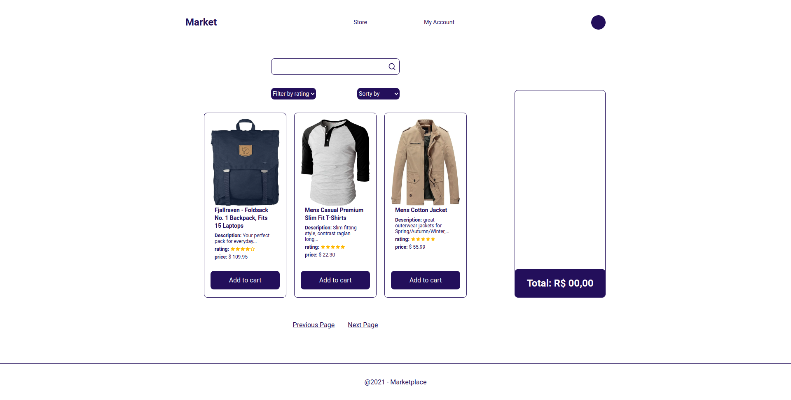

<p align="center">
  
</p>

<h1 align="center">Market Shopping</h1>
<p align="center">A market where you can find anything you want to buy.</p>

<h3 align="center">
  <a href="https://www.npmjs.com/" target="_blank">
    
  </a>
  <a href="#" target="_blank">
    
  </a>
  <a href="https://twitter.com/matheuseufra" target="_blank">
    
  </a>
</h3>

<br />

## See it in production

<a target="_blank" href="https://market-eta.vercel.app/">Market Shopping - Published on Vercel</a>

## Running locally

Clone de repository, open its folder and install dependencies with:

```sh
yarn
```

Run it using:

```sh
yarn start
```

## Preview

Sample preview running the app:



## Usage & settings

After running for the first time you can access the app settings through the tray menu and click on "Settings" to change default shortcuts, camera size, zoom, etc.

### What I use

<ul>
  <li>Nextjs</li>
  <li>Typescript</li>
  <li>Redux</li>
  <li>Styled Components</li>
  <li>Hooks</li>
  <li>Axios</li>
</ul>

## Author

👤 **Matheus Eufrásio**

- Twitter: [@matheuseufra](https://twitter.com/matheuseufra)
- Github: [@matheuseufrasio2](https://github.com/matheuseufrasio2)
- LinkedIn: [@matheusveufrasio](https://www.linkedin.com/in/matheusveufrasio/)

## Show your support

Give a ⭐️ if this project helped you!
